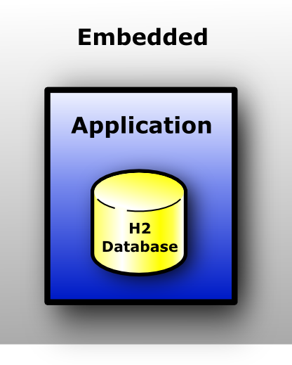

# H2
- [H2 主要特色]()
- [H2 連線方式]()
	- [Embedded Mode]()
	- [Server Mode]()
	- [Mixed Mode]()
- [資料庫類型]()
	- [In-memory Database]()
- [其它連線設定]()
	- [Encrypted Files]()
	- [Trace]()
	- [Execute SQL on connection]()
	- [Custom file access mode]()
	- [Auto-reconnect]()
	- [Automatic mixed mode]()
	- [Compatibility mode]()
- [其它功能]()
	- [User-Defined Functions and Stored Procedures]()
		- [Referencing a Compiled Method]()
		- [Declaring Functions as Source Code]()
	- [Read CSV]()
	- [Write CSV]()
	- [Connection Pool]()
	- [Triggers]()
- [References]()


# H2 主要特色
- Open source
- 使用 Java 撰寫
- 支援標準 SQL 和 JDBC API
- 可使用 PostgreSQL ODBC driver
- Embedded Mode and Server Mode
- Multi version concurrency
- Disk based or in-memory databases
- Encrypted database
- ...


# H2 連線方式
H2 只允許一個應用直接對資料庫檔案存取，其它的應用必須透過 Server 對資料庫存取。

## Embedded Mode
Embedded Mode 讓應用直接對資料庫檔案存取。



`jdbc:h2:file:[path]/[db_name]`

## Server Mode
Server Mode 需先與 Server 建立連線，指令是送到 Server 的 JVM 執行。Server 對資料庫的連線是用 Embedded Mode。


`jdbc:h2:tcp://[url]/[db_name]`

## Mixed Mode
Mixed Mode 讓第一個應用使用 Embedded Mode 方式連線，且讓應用的 JVM 用 daemon thread 開啟一個 Server。


`jdbc:h2:file:[path]/[db_name];AUTO_SERVER=TRUE`


# 資料庫類型
- Persist Database - 存在硬碟裡的資料
- In-memory Database - 存在記憶體的資料

## In-memory Database
In-memory Database 必須要與連線的 JVM 是同一個才有辦法存取，所以若要多個連線同時存取同個 In-memory Database，連線要以 Server Mode 方式。

`jdbc:h2:tcp://[IP]:[Port]/mem:[db_name]`

預設所有連線都關閉時會將 In-memory DB 刪除，若要保留需加入參數:

`;DB_CLOSE_DELAY=-1`


# 其它連線設定
## Encrypted Files
除了使用帳號密碼過濾連線，本地端的資料庫檔案可以加密防止檔案外洩被看到內容。在創建資料庫時就要決定是否對檔案加密，且每次連線都要設定當初加密的 CIPHER 方法。

*`;CIPHER=`*
> - *`AES`* - also known as Rijndael, only AES-128 is implemented.  
> - *`XTEA`* - the 32 round version.  
> - *`FOG`* - pseudo-encryption only useful for hiding data from a text editor.  

> 加密的檔案需要設定檔案密碼，檔案密碼與使用者密碼一起設定和登入。  
> *`;PASSWORD="[file_password][space][user_password]"`*。  
> 例如預設都是空字元，則 `;PASSEORD=" "`。

圖、加密前資料庫檔案內容  
  
圖、加密後資料庫檔案內容  


## Trace
Trace 紀錄操作系統的資訊，有兩種地方會顯示操作資訊:
- System.out
- File

顯示的內容有四種可以選擇:
- OFF - 代號 0，不紀錄。
- ERROR - the default，代號 1，紀錄 Exception 訊息。
- INFO - 代號 2，紀錄 SQL statement 訊息。
- DEBUG - 代號 3，含以上訊息和資料庫系統訊息。

*`;TRACE_LEVEL_SYSTEM_OUT=`*  
*`;TRACE_LEVEL_FILE=`*

圖、trace 檔  


## Execute SQL on connection
因 in-memory 資料庫每次關閉後資料即消失，下次使用須重新建立資料表。利用連線時執行 SQL 腳本可以將建立資料表的程式碼打在腳本內，連線時利用腳本初始化資料庫，使得每次使用時就有一個初始化過的環境。

例如在管理網路連線的 Session 並不需要永久記錄，而且此紀錄是頻繁操作的資料，此情況很適合使用。但每次開起都要手動建立很不實際，使用腳本
方式建立比較方便。

```sql
/* Writed in conns.sql */
CREATE TABLE connections (
    sessionId VARCHAR NOT NULL,
    term timestamp NOT NULL
)
```

*`;INIT=runscript from './scripts/conns.sql'\\;
runscript from './scripts/init.sql'`*

> 多個 scripts 使用 "**\\\\;**" 分隔。

## Custom file access mode
資料庫連線預設是可讀取/可寫入模式，對於沒有寫入需求的使用者應該關閉寫入功能，以減少意外發生。

*`;ACCESS_MODE_DATA=r`*

圖、Read-only 訊息


## Auto-reconnect
重連會建立新的 session，其變數和暫存的資料表會被重新建立，如果不重連會拋出例外。

*`;AUTO_RECONNECT=TRUE`*

## Automatic mixed mode
第一個連到資料庫的使用者只能使用 Embedded Mode，同時會自動使用 daemon thread 開始 Server。Server 的 IP 和 Port 被儲存在 [DB_Name].lock.db 內。

> JVM 中的 daemon thread 是即使 program 結束，此執行緒還在 JVM 上執行。典型的應用就是 Garbage Collection。

如果第一個連線的使用者關閉連線，Server 也會被關閉。若此時還有其它使用者在使用，會由其中一個使用者以 Server Mode 連線到資料庫。

*`;AUTO_SERVER=TRUE`*

## Compatibility mode
H2 支援 ANSI SQL standard，且試圖相容其它資料庫。目前支援的其它資料庫有，DB2、Derby、HSQLDB、MSSQLServer、MySQL、Oracle、PostgreSQL 和 Ignite。

*`;MODE=`*


# 其它功能
## User-Defined Functions and Stored Procedures
除了內建的函式外，H2 提供讓使用者自建 Java 函式。有兩種方式可以使用自建函式:

### Referencing a Compiled Method
這種方式在自己的環境編譯好後將類別檔匯入到資料庫內。如果是用 Server Mode 方式連接，需要再開 Server 的 JVM 上設定 classpath，否則會發生 not found 錯誤。

```java
package acme;
import java.math.*;
public class Function {
    public static boolean isPrime(int value) {
        return new BigInteger(String.valueOf(value)).isProbablePrime(100);
    }
}
```

```sql
CREATE ALIAS IS_PRIME FOR "acme.Function.isPrime";
```

### Declaring Functions as Source Code
這種方式式將程式碼送到 Server 上的 JVM 編譯，所以不需要設定 classapth，除非是要用外部的 package。

此種模式不支援 function overloading，請使用 Referencing a Compiled Method。

```sql
CREATE ALIAS NEXT_PRIME AS $$

import java.net.*;
@CODE

String nextPrime(String value) {
    return new BigInteger(value).nextProbablePrime().toString();
}
$$;
```

### 設定 T24 H2 Server 的 classpath
啟動 T24 的批次檔 StartUp.bat 裡有一行:
```bat
java -server -Xmx4096M 
-cp 
    .\h2-%H2_VERSION%.jar
    ;%TAFJ_HOME%\dbscripts\h2\TAFJFunctions.jar 
    ;[Your .jar]
org.h2.tools.Server 
-tcp -tcpPort 7075 -tcpAllowOthers 
-baseDir %SLOT_HOME%\Data\T24 
>%LOG_HOME%\h2.log 2>&1
```

> - 這裡也可以發現 T24 自建的函式。
> - -baseDir %SLOT_HOME%\Data\T24 這個參數設定 Server 的根目錄，資料庫檔案 TAFJDB.h2.db 也放這裡。  
> - 所以連線的 URL: `tcp://localhost:7075/TAFJDB`

加入後，對 Server 的 SQL statement 做關於匯入類別的指令就不會發生 class not found 的例外。

## Read CSV
**built-in function:**  
`SELECT * FROM CSVREAD('test.csv');`

**Java application:**  
`ResultSet rs = new Csv().read("data/test.csv", null, null);`  
`read(String inputFileName, String[] colNames, String charset)`

## Write CSV
**built-in function:**  
`CALL CSVWRITE('test.csv', 'SELECT * FROM TEST');`

**Java application:**  
`new Csv().write("data/test.csv", resultSetObject, null);`  
`write(String outputFileName, ResultSet rs, String charset)`

## Connection Pool
文件中提到頻繁的開啟和關閉連線會影響效能，所以 H2 使用 Connection Pool 改善這個問題。Connection Pool 在操作時一樣是對 Connection 物件做關閉，但實際上是存在 Connection Pool 裡。

對 Connection 和 Connection Pool 做一個小測試，資料庫連線用 Server Mode，各執行 100 次開啟和關閉，觀察時間差。

圖、時間成長


## Triggers
Trigger 功能可以在資料庫連線、關閉、特定 SQL Statement 執行或移除 Trigger 時自動執行自定義任務。

)

> - 關閉連線執行 close()  
> - SQL Statement 執行 fire(...)  
> - 建立 Trigger 和連線時\執行 init(...)  
> - 移除 Trigger 執行 remove()  

1. `CREATE TRIGGER DEMO_TRIGGER AFTER INSERT ON CONNECTIONS FOR EACH ROW CALL "org.iisi.demo.DemoTrigger"`
2. `INSERT INTO CONNECTIONS VALUES (6, 'Demo', '2019-11-04');`
3. Disconnect
4. Connect
3. `DROP TRIGGER DEMO_TRIGGER`

> 圖、觸發結果
> 


# References
- [H2 Features](http://www.h2database.com/html/features.html)
- [H2 Tutorial](https://www.h2database.com/html/tutorial.html)
- [H2 Javadoc](http://www.h2database.com/javadoc/index.html)